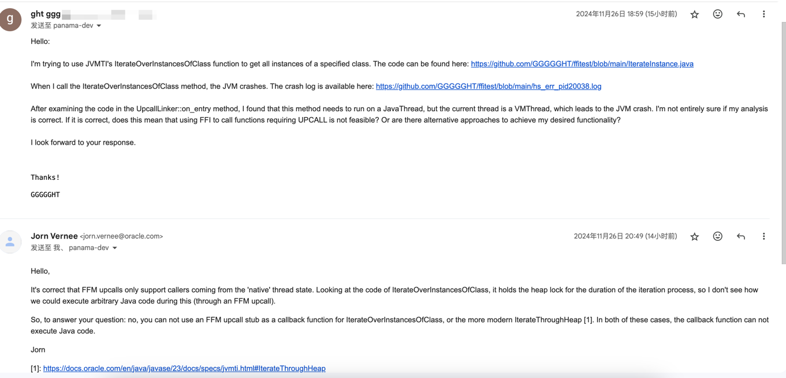

# FFICrash

Use Java22 FFI[^1] call JVMTI[^2] function

## env
- java version: 23.0.1 <br/>
- os: CentOS Linux release 7.9.2009 (Core)

### jextract[^3]
```
jextract -t org.openjdk.jvmti -I ${JAVA_HOME}/include/linux ${JAVA_HOME}/include/jvmti.h
```

### generate dynamic library
```sh
gcc -shared -o libmyjvmti.so test.cpp -I${JAVA_HOME}/include -I${JAVA_HOME}/include/linux -fPIC
```

### run 
```
java --enable-native-access=ALL-UNNAMED IterateInstance.java
```

### end
> During the execution of this function the state of the heap does not change: no objects are allocated, no objects are garbage collected, and the state of objects (including held values) does not change. As a result, threads executing Java programming language code, threads attempting to resume the execution of Java programming language code, and threads attempting to execute JNI functions are typically stalled.[^4]
[^5]

在执行此函数期间，堆的状态不会改变：不会分配任何对象，不会对任何对象进行垃圾回收，并且对象的状态（包括保存的值）不会改变。因此，执行 Java 编程语言代码的线程、尝试恢复 Java 编程语言代码执行的线程以及尝试执行 JNI 函数的线程通常会停滞。
所以 需要 upcall 的函数均无法通过 FFI 去执行

[^1]: https://openjdk.org/jeps/454
[^2]: https://docs.oracle.com/javase/8/docs/platform/jvmti/jvmti.html
[^3]: https://jdk.java.net/jextract
[^4]: https://docs.oracle.com/en/java/javase/23/docs/specs/jvmti.html#IterateThroughHeap:~:text=class.%20This%20includes%20both%20reachable%20and%20unreachable%20objects.-,The%20object_filter%20parameter%20indicates%20the%20objects%20for%20which%20the%20callback%20function,code%2C%20and%20threads%20attempting%20to%20execute%20JNI%20functions%20are%20typically%20stalled.,-Phase
[^5]: https://mail.openjdk.org/pipermail/panama-dev/2024-November/020800.html

